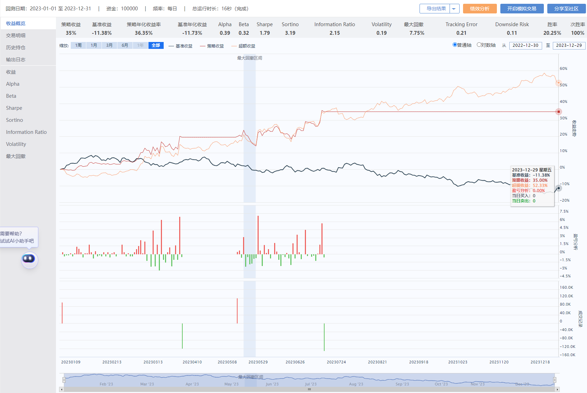

## 1. 原理
### 核心思想
“均值回归”策略是一种基于统计套利的量化交易策略，它利用价格的短期偏离和长期均值的回归关系进行交易。该策略的核心思想是，**当价格偏离其长期均值时，存在一种趋势，即价格将回归到其均值水平。**

### 操作步骤
- 选择投资标的
- 计算资产价格的均值。常见计算方法包括移动平均线、指数平滑移动平均线、加权移动平均线等。
- 确定价格波动的阈值。当价格超过或低于设定的阈值时，认为存在偏离长期均值的机会。
- 当价格波动超过阈值时，认为价格会回归到均值，采取相应的交易策略。例如，买入价格偏低的资产，同时卖出价格偏高的资产，以期望价格回归时获得利润。
- **设置止损和盈利目标**。为了控制风险，必须设置止损和盈利目标，以便在价格变动超过一定程度时平仓。

### 注意事项
“均值回归”策略也存在一定的风险，因为价格在短期内可能不会回归到其长期均值，而是可能出现趋势延续或结构性变化。因此，在实际应用中，需要进行充分的研究和测试，并结合风险管理和其他技术指标来提高策略的可靠性和盈利能力。

## 2. 策略逻辑
- 第一步： 获取数据，计算均线
- 第二步： 设置价格波动的阈值
- 第三步： 超过阈值，进行交易
- 第四步： 设置止损和盈利目标

## 3. 策略代码
见源码，在SuperMind平台上测试运行。

## 4. 策略效果
以中国石油（）为例，资金10万，回测周期2023-01-01至2023-12-31，策略收益率35.0%。

## 5. 策略分析
- 本例中交易实际并没有怎么触发，因为中石油在那个周期里是持续上涨的，并不符合均值回归的思想。另外，本例中参数也需要调整
- 均值算法可以用不同的均值算法进行尝试
- 价格波动的阈值，可以通过一定的方式计算得出，比如一段时间内的标准差等。