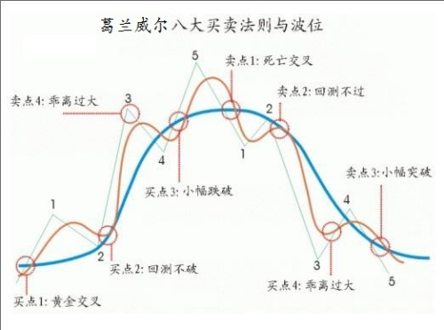
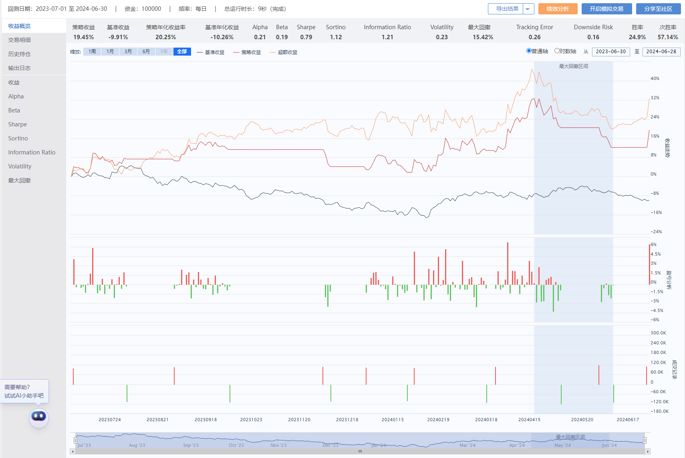

## 1. 原理
### 均线的“前世今生”
均线，一个进行形态分析时总也绕不过去的指标。

均线最早由美国投资专家Joseph E.Granville(格兰威尔)于20世纪中期提出，现在仍然广泛为人们使用，成为判断买卖信号的一大重要指标。从统计角度来说，均线就是历史价格的平均值，可以代表过去N日股价的平均走势。

1962年7月，Joseph E.Granville在他的书中提出了著名的Granville八大买卖法则。只利用股价和均线即可进行择时，方法简单有效，一经提出，迅速受到市场追捧。尤其是其中的金叉和死叉信号，更是沿用至今。

Granville 八大法则其中有四条是用于判断买进时机，另外四条是用于判断卖出时机。买进和卖出法则一一对应，分布在高点的左右两侧（除买4和卖4以外）。法则内容如下所示：

买1：均线整体上行，股价由下至上上穿均线，此为黄金交叉，形成第一个买点。
买2：股价出现下跌迹象，但尚未跌破均线，此时均线变成支撑线，形成第二个买点。
买3：股价仍处于均线上方，但呈现急剧下跌趋势。当跌破均线时，出现第三个买点。
买4：（右侧）股价和均线都处于下降通道，且股价处于均线下方，严重远离均线，出现第四个买点。

卖1：均线由上升状态变为缓慢下降的状态，股价也开始下降。当股价跌破均线时，此为死亡交叉，形成第一个卖点。
卖2：股价仍处于均线之下，但股价开始呈现上涨趋势，当股价无限接近均线但尚未突破时，此时均线变成阻力线，形成第二个卖点。
卖3：股价终于突破均线，处于均线上方。但持续时间不长，股价开始下跌，直至再一次跌破均线，此为第三个卖点。
卖4：（左侧）股价和均线都在上涨，股价上涨的速度远快于均线上涨的速度。当股价严重偏离均线时，出现第四个卖点。

### 均线理论为什么有效？
Shiller（1981）在研究中发现，资产的长期价格呈现均值回复的特征，即从长期来看，资产的价格会回归均值。这也是均线理论被广泛应用的前提。

### 均线理论的缺陷
均线归根到底是一种平均值，平均值在应用过程中存在最大的问题就是其滞后性。当出现买入卖出信号时，最佳时机早已过去。举例来说，如果A股票最新价格出现了较大的涨幅，股价和均线都上涨，但均线的速度慢于股价上涨速度。此时，从形态上来看，金叉出现，为买入信号。次日，股价回调，股价下降的速度快于均线下降的速度，形成死叉，为卖点。这样一买一卖不仅没有盈利，反而出现亏损。

### 均线理论的改进
针对均线的缺点，市场上提出了各种各样的改进方法。

#### 1. 对均线的计算方法进行改正。

加权移动平均线是在移动平均线的基础上按照时间进行加权。越靠近当前日期的价格对未来价格的影响越大，赋予更大的权重；越远离当前日期价格，赋予越小的权重。

#### 2.调整均线周期

利用不同周期均线得到的结果也不同。许多有经验的投资者发现，在不同的市场中，有些均线的效果显著优于其他周期均线。有些长线投资者还会将股价替换成短周期均线进行趋势判断。

## 2. 策略逻辑
- 第一步： 获取数据，计算长短期均线
- 第二步： 设置交易信号
    - 当短期均线由上向下穿越长期均线时（死叉）做空
    - 当短期均线由下向上穿越长期均线时（金叉）做多

## 3. 策略代码
见源码，在SuperMind平台上测试运行。

## 4. 策略效果
以中国石油（）为例，资金10万，回测周期2023-07-01至2024-06-30，策略收益率19.45%，效果比较不错。

